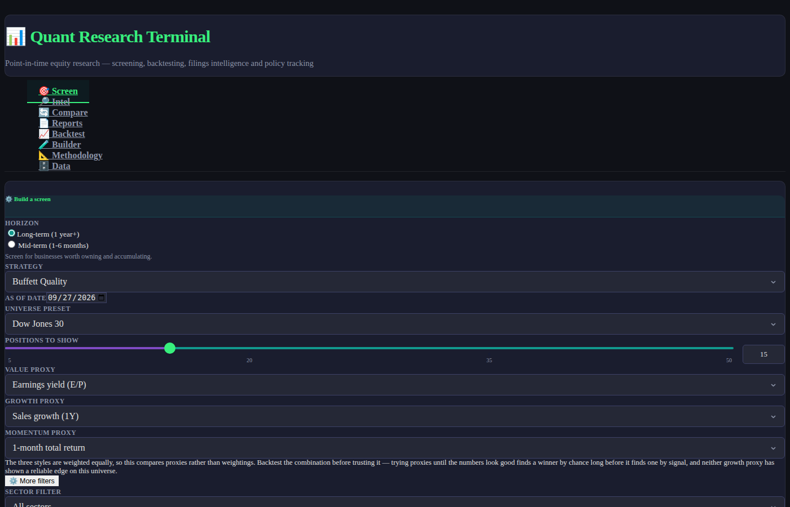
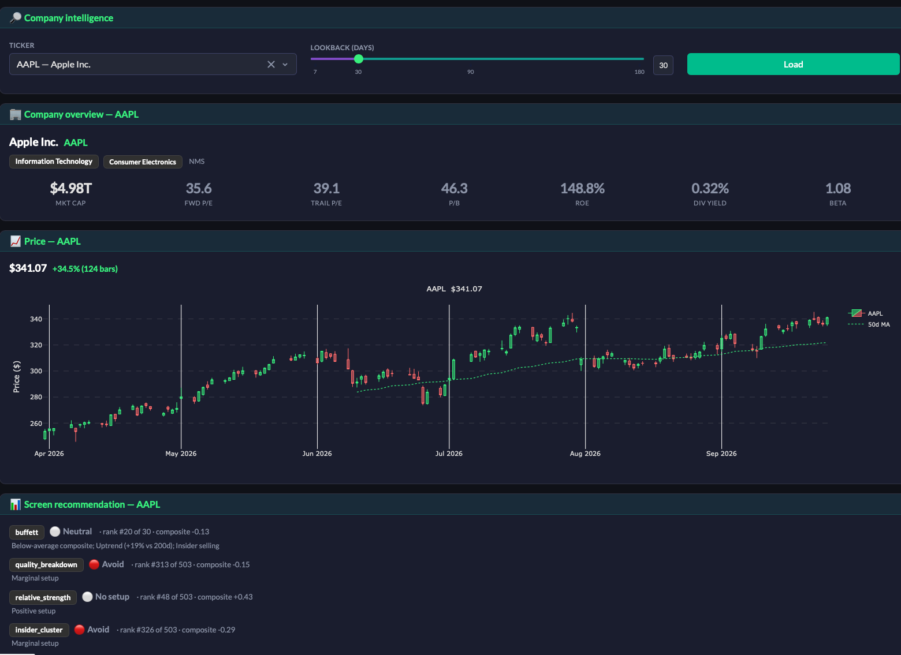

# Quant Research Terminal

A local web app for **mid- and long-horizon** equity research. It stores everything it fetches, so you can re-run a screen **as of any past date**, compare today against a month or a year ago, and backtest a strategy without accidentally using information that did not exist yet.

Runs entirely on your machine — `python3 app.py`, then open `http://localhost:8050`. Uses only free data sources; **no API keys required** for data, screening, or backtesting. An optional [AI analysis layer](#optional-ai-analysis-layer) adds natural-language interpretation when a Gemini or Anthropic key is set.

```bash
bash run.sh          # install, create the database, load the Dow 30, launch
```

<p align="center">
  
</p>
<p align="center"><em>Screen tab: Buffett Quality on the S&P 500 — ranked results with sector mix and signal breakdown</em></p>

<p align="center">
  
</p>
<p align="center"><em>Intel tab: company overview, candlestick chart with 50d MA, and screen recommendations across strategies</em></p>

---

## Two horizons, two different jobs

The app treats these as separate questions rather than one ranked list, because they are.

| | **Long-term** (1 year+) | **Mid-term** (1–6 months) |
|---|---|---|
| Question | *Is this business worth owning?* | *Is this worth trading now?* |
| Driven by | Returns on capital, balance sheet, valuation, earnings durability | Trend, catalyst, positioning; fundamentals only as a filter |
| Output | Rank, signal, and the reasoning behind it | Entry, stop, target, time stop, position size |
| Exit | A broken thesis — no price level | Stop hit, target hit, time stop, or trend break |
| Rebalance | Quarterly | Monthly, with intra-period stops |
| Strategies | Quality Value, Deep Value, Piotroski, Compounder, Dividend Quality, Low Volatility, GARP, Multi-Factor | Momentum + Trend, 52-Week Breakout, Pullback, Post-Earnings Drift, Insider Cluster, Mean Reversion |

Position sizes are **percentages of portfolio** implied by a risk budget and the stop distance — a wider stop earns a smaller position. The app knows nothing about your account and never asks.

---

## How a run works: pull, then read

Every run has two phases, always in this order.

```
┌─ 1. PULL ────────────────────────────────────────────────────┐
│  data/sync.py asks each source: are you inside your window?  │
│    fresh  → skip, no network call                            │
│    stale  → fetch and write to SQLite                        │
└──────────────────────────────┬───────────────────────────────┘
                               ▼
┌─ 2. READ ────────────────────────────────────────────────────┐
│  quant/ computes from the database only. No network access   │
│  exists on this path, so a read cannot surprise you.         │
└──────────────────────────────────────────────────────────────┘
```

Each source declares how long its data stays good, chosen from how fast the underlying thing actually changes:

| Source | Refresh after | Why |
|---|---|---|
| Daily bars | 12h, and only once the session has closed | A bar does not exist before the close |
| SEC XBRL facts | 12h | New facts appear only when a filing lands |
| SEC filings / 8-K | 12h | Same |
| Form 4 insiders | 24h | Filed within two business days of a trade |
| News | 3h | The only genuinely fast-moving source |
| Federal Register | 12h | Publishes on business mornings |
| Market-cap snapshots | 24h | Rate-limited; best effort |
| Index membership | 7d | Changes on scheduled reviews |
| Security master | 30d | CIK and SIC are effectively static |

Staleness is tracked **per ticker**, so a universe where 490 of 500 names were updated this morning fetches only the other ten.

### Why this makes it fast

Built factor frames are cached on disk, keyed by universe, as-of date, and a *data version* derived from the store — row counts and newest `filed`/`date`. Ingest anything and the version moves and the cache is bypassed; ingest nothing and the previous frame is served. So the two phases compose:

```
first run on a cold store   pull 118k rows, build factors    ~76s
same run, nothing stale     no fetches, cached factors        ~0.2s
```

That is not a staleness trade. A cache hit is only possible when the store is provably unchanged, so the fast answer and the slow answer are the same answer.

Historical as-of dates skip the pull entirely — fetching *today's* data cannot inform a past date, and would only invalidate caches.

```bash
python cli.py freshness
```

shows what is fresh, what is stale, and what the next run would fetch. The Data tab shows the same thing.

---

## What makes the numbers trustworthy

Most of the engineering here is about not fooling yourself.

**Point-in-time everything.** Every SEC fact carries a `filed` date, and all reads are gated on it. Apple's quarter ending 2026-06-27 was not public until 2026-07-31 — a five-week gap that would silently inflate any backtest that used the period end instead.

**Survivorship bias is handled.** Index membership is reconstructed historically from Wikipedia page revisions and cross-checked against the ETF's own SEC N-PORT filings. The S&P 500 on 2021-06-01 contained ABMD, ATVI, XLNX and 92 other names that are gone today; scoring a 2021 date against today's list would quietly load the test with winners.

**XBRL duration disambiguation.** Apple's FY2026 Q3 returns *two* `NetIncomeLoss` facts with the same end date and the same filing date: 29,789M for the quarter and 101,464M for the nine months to date. Only `period_start` separates them. Summing naively overstates TTM by about 3.4×.

**Restatements respect what was knowable.** A figure revised in August is not visible to a screen dated in June.

**Adjusted and unadjusted prices are never mixed.** Stops and targets derive from adjusted closes, so the high/low bars used to detect hits are scaled onto the same basis. Comparing an adjusted stop against a raw high made every trade appear to hit its target instantly — and turned a Sharpe of 1.6 into a fictional 3.3.

**Predictive power is reported, not just returns.** Every backtest shows rank IC alongside CAGR, and the UI flags it when the correlation is near zero — which means any outperformance came from a few positions rather than from the ranking working.

---

## Data sources — all free, no keys

| Source | Provides | Backtestable? |
|---|---|---|
| **SEC EDGAR XBRL** | Point-in-time fundamentals, every fact filing-dated | ✅ full history |
| **SEC submissions** | 8-K corporate events by item code, Form 4 insider trades, SIC sector | ✅ full history |
| **SEC N-PORT** | ETF holdings, for cross-checking index membership | ✅ 2019+, ~58-day lag |
| **MediaWiki revisions** | Historical index constituents | ✅ ~2007+ |
| **Yahoo chart API** | Daily OHLCV | ✅ full history |
| **Wikimedia pageviews** | Retail attention proxy | ✅ full daily history |
| **Federal Register** | Rules and executive orders, mapped to sectors | ✅ full history |
| Yahoo / Google News RSS | Company coverage, sentiment, direction extraction | ⚠️ **forward only** |

The last row is the honest exception: free news APIs return only recent items, so news signals work live from day one but cannot be backfilled. Everything else carries a filing or publication date and is backtestable immediately — which is why the strategies lean on filings rather than headlines.

### On sector classification

Sectors come from the SEC's SIC codes, not from `yfinance.info`. That endpoint is the most heavily rate-limited provider in the stack; during the first full ingest of this project it returned nothing at all, which left every name classified `Unknown` and silently collapsed the sector-relative z-scores into one meaningless bucket. SIC is coarser than GICS and imperfect at the margins, but a mostly-right sector beats a universally absent one.

---

## News, filings and policy intelligence

Sentiment is the least interesting output here. The extraction targets **what changes a thesis**:

- **Guidance** — raised, lowered, reaffirmed, withdrawn, beat, missed
- **Capital allocation** — buybacks, dividend increases and cuts
- **Strategy** — M&A, divestitures, restructuring, partnerships
- **Management** — CEO/CFO/board changes (8-K item 5.02 catches these deterministically)
- **Legal & regulatory** — litigation, investigations, approvals
- **Policy** — Federal Register rules and executive orders, mapped from issuing agency to affected sectors

Sentiment uses the **Loughran-McDonald** financial lexicon rather than a general-purpose one, because in financial text "liability", "cost" and "depreciation" are neutral and everyday sentiment tools read them as negative. Event direction feeds back into the score, so "Management raised guidance and announced a buyback" reads as positive even though it contains no sentiment vocabulary at all.

All of this works offline with no keys.

### Optional: AI analysis layer

Set one key in `.env` and an interpretation layer appears on top of the numbers:

```bash
GEMINI_API_KEY=...        # aistudio.google.com/apikey — no extra package needed
# or
ANTHROPIC_API_KEY=...     # needs: pip install anthropic
```

`LLM_PROVIDER` accepts `auto | gemini | anthropic | off`. Under `auto` Gemini wins when its key is present; naming a provider explicitly never silently falls back to the other vendor, since that would bill an account you did not choose.

| Tab | What it adds |
|---|---|
| **Screen** | Why the strategy ranked these names, read off the actual factor exposures |
| **Research** | A candid read of the backtest — including saying so when rank IC shows the ranking had no predictive power |
| **Intel** | Cross-article synthesis: company direction, guidance, capital allocation; plus a sector read on recent policy |
| **Compare** | What changed between two run dates, and which factors drove the rotation |
| **Data** | Whether the layer is live, and on which backend |

**It never changes a score, a rank, or a trade level.** Those stay deterministic and reproducible from the formulas in the Methodology tab — the model is handed *computed* figures and asked to interpret them, so a hallucination can mislead a reader but cannot corrupt a backtest. Every panel is labelled with the model that wrote it.

The app is fully functional without a key: every panel degrades to a stated reason rather than a blank space, and a missing key, an expired key, a rate limit, a network failure and a safety refusal are each handled and logged distinctly.

> A worked example of why this layer is worth having: on a Dow backtest showing 27.2% CAGR and a Sharpe of 2.20, the generated read opens *"No. The underlying ranking model demonstrated no positive predictive power"* — because mean rank IC was −0.045. Flattering equity curves are exactly where a second opinion earns its keep.

**Neither a Claude Pro/Max nor a Gemini consumer subscription includes API access.** Both developer APIs are billed separately, pay-as-you-go. Usage here is small — a handful of short calls per run.

---

## Command line

Everything the UI does is available headlessly, which is what makes scheduling possible.

```bash
python3 cli.py init                                     # create the schema
python3 cli.py ingest --index DIA --full                # 30 names, everything
python3 cli.py ingest --index SPY --full --members-from 2015-01-01

python3 cli.py strategies                               # list, by horizon
python3 cli.py screen --universe "SPY,sector=Health Care,mcap>5B" \
                      --strategy quality_value
python3 cli.py screen --strategy momentum_trend --top 10   # mid-term + plans

python3 cli.py backtest --strategy quality_value --start 2020-01-01
python3 cli.py report --kind daily --email you@example.com
python3 cli.py status                                   # coverage and freshness
```

### Universe expressions

```
SPY                                        index members, point-in-time
sector=Information Technology,mcap>10B     compose filters
SPY,sector=Health Care,adv>25M,top=50      cap by size rank, never at random
```

### Scheduling

```cron
0 18 * * 1-5  cd /path/to/trading && python3 cli.py ingest --index SPY --full
0  7 * * 1-5  cd /path/to/trading && python3 cli.py report --kind daily \
                  --strategy quality_value --email you@example.com
0  8 1 * *    cd /path/to/trading && python3 cli.py report --kind monthly \
                  --strategy quality_value --email you@example.com
```

---

## The six tabs

**Screen** — universe builder and ranked results; the horizon toggle changes what the page is for.
**Compare** — two run dates, rank migration, entrants and dropouts, signal changes.
**Research** — backtest with equity curve, drawdown, and the rank-IC honesty panel.
**Intel** — company direction, 8-K events, insider activity, and a policy panel.
**Reports** — generate, preview and email daily or monthly briefs.
**Data** — coverage, freshness, and where the membership sources disagree (shown, not hidden).

---

## Layout

```
config.py            tunables, sector map, SEC tag map, agency→sector map
cli.py               headless interface (cron-able)
app.py               Dash entry point
core/                db.py (SQLAlchemy schema), http.py (throttle + cache)
data/                members, yahoo, sec, classify, news, policy, altdata, universe
quant/               fundamentals, factors, transforms, strategies,
                     tradeplan, signals/engine, risk, backtest, research
nlp/                 sentiment (Loughran-McDonald), extract, summarize
reports/             builder (HTML), email
ui/                  theme, components, layout, pages/
tests/               278 tests, including the look-ahead assertions
```

Storage is SQLite by default (~250–300 MB for 500 tickers × 10 years). Because the data layer is SQLAlchemy, moving to a hosted database is a `DATABASE_URL` change — Turso is the easiest since it *is* SQLite.

---

## Testing

```bash
python3 -m pytest -q
```

The suite covers the transforms against hand-computed values, Wilder RSI against a reference, TTM assembly from a fixture containing the real Apple duplicate-duration case and a restatement, trade-plan sizing arithmetic, backtest metrics against an analytically known curve, and the point-in-time assertions — including that a factor computed as of date `T` references no row dated after `T`.

---

## Known limitations

- **Rank IC is weak on small universes.** A 30-name index is too narrow for cross-sectional ranking to mean much; the Dow backtest beats its benchmark while showing essentially zero IC. Use the S&P 500 for anything you intend to believe.
- **News cannot be backfilled** (above). It accumulates forward.
- **SIC → GICS is approximate.** Alphabet lands in Information Technology rather than Communication Services, for instance.
- **`yfinance.info` is unreliable.** Market cap and forward P/E fall back to SEC-derived estimates when it is throttled; the app is built not to depend on it.
- **Backtests ignore borrow costs, taxes, and market impact**, and assume you can transact at the closing price.

---

## ⚠️ Disclaimer

This is an automated quantitative research tool for **informational and educational purposes only**. Nothing it produces is investment advice or a recommendation to buy or sell any security. Scores, signals, and any entry, stop or target levels are mechanical outputs of published rules — not judgements about your circumstances, objectives or risk tolerance. Backtested results are hypothetical, do not reflect actual trading, and are no guarantee of future performance. Data comes from free public sources and may be delayed, incomplete or wrong. Do your own research and consider consulting a licensed financial adviser.
